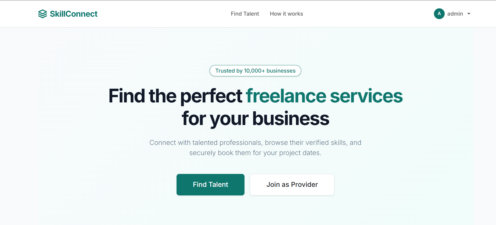
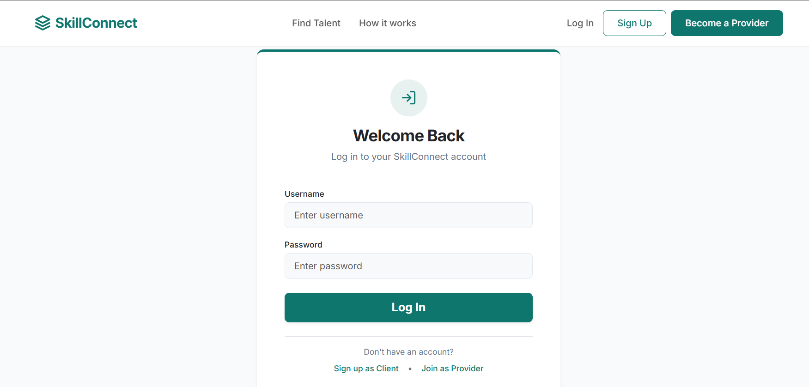
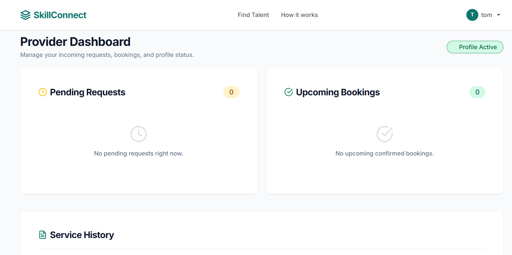
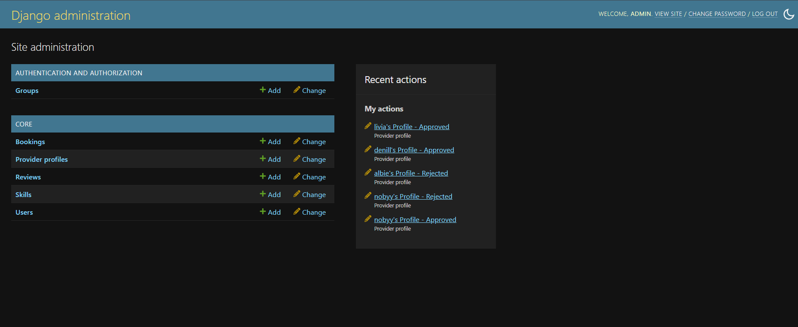

<div align="center">

# 🚀 SkillConnect

### A Skill Sharing Platform Built with Django

Connect skilled professionals with customers through a secure and user-friendly platform.


</div>

---

# 📖 Overview

SkillConnect is a web-based platform that connects skilled professionals with users looking for services. It enables customers to discover verified service providers, book services, and manage bookings through an intuitive interface.

---

# ✨ Features

### 👤 User

- Register and Login
- Browse verified service providers
- Search by skill
- View provider profiles
- Book services
- Manage bookings
- View booking history

### 🛠 Provider

- Register as a provider
- Add multiple skills
- Manage profile
- Accept or reject booking requests
- Track completed bookings

### 🔐 Admin

- Verify providers
- Manage users
- Manage providers
- Manage bookings
- Monitor platform activities

---

# 🛠 Tech Stack

| Technology | Usage |
|------------|-------|
| Python | Backend |
| Django | Web Framework |
| HTML5 | Frontend |
| CSS3 | Styling |
| JavaScript | Client-side Interactions |
| MySQL / SQLite | Database |
| Git | Version Control |
| GitHub | Repository Hosting |

---

# 📂 Project Structure

```text
Skill-Sharing-Platform
│
├── core/
├── skillconnect/
├── static/
├── templates/
├── media/
├── manage.py
├── db.sqlite3
└── README.md
```

---

# 📸 Screenshots

### 🏠 Home Page



### 🔐 Login



### 👤 Provider Dashboard



### 👨‍💼 Admin Panel



---

# ⚙ Installation

Clone the repository

```bash
git clone https://github.com/joyaljoshey777-max/Skill-Sharing-Platform.git
```

Move into the project

```bash
cd Skill-Sharing-Platform
```

Create a virtual environment

```bash
python -m venv venv
```

Activate the virtual environment

**Windows**

```bash
venv\Scripts\activate
```

Install dependencies

```bash
pip install -r requirements.txt
```

Run the server

```bash
python manage.py runserver
```

Open

```
http://127.0.0.1:8000/
```

---

# 📌 Future Enhancements

- 💳 Online Payment Integration
- 🔔 Real-time Notifications
- ⭐ Provider Ratings & Reviews
- 📱 Responsive Mobile Design
- ☁ Cloud Deployment (AWS)
- 💬 Real-time Chat

---

# 👨‍💻 Developer

**Joyal Joshey**

🎓 MCA Student

💻 Software Development Enthusiast

☁ Cloud Computing Enthusiast

---

# 📬 Contact

📧 Email: **joyaljoshey777@gmail.com**

💼 LinkedIn: **https://www.linkedin.com/in/joyal-joshey-367551414/**

---

<div align="center">

### ⭐ If you like this project, consider giving it a Star!

</div>
